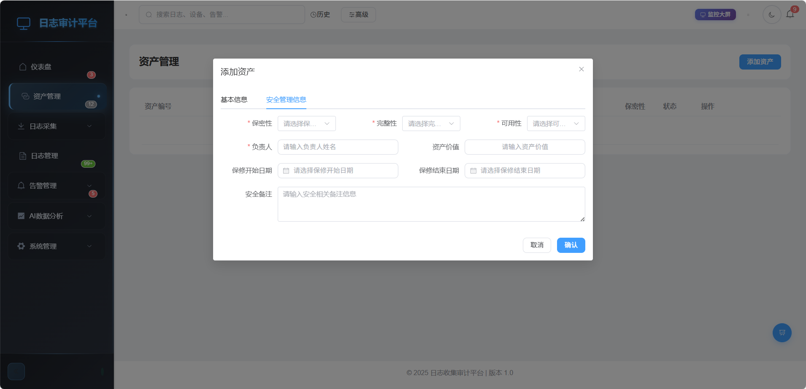
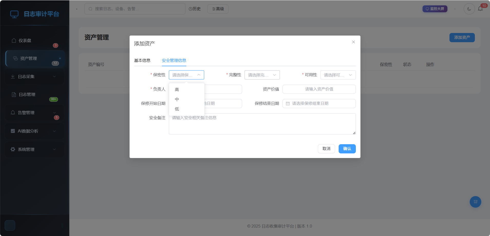
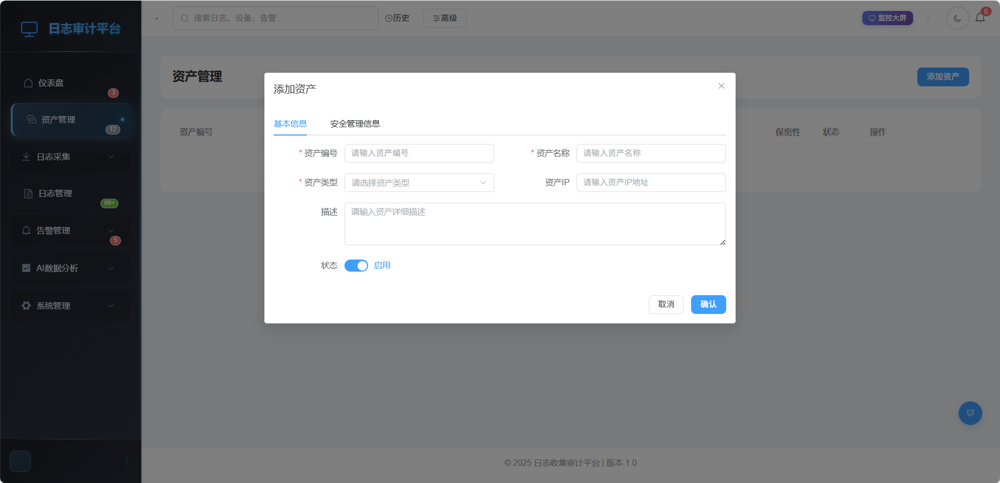
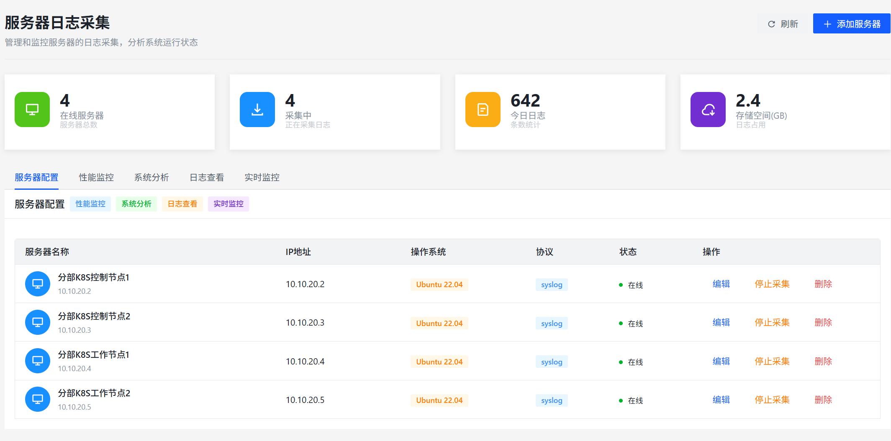
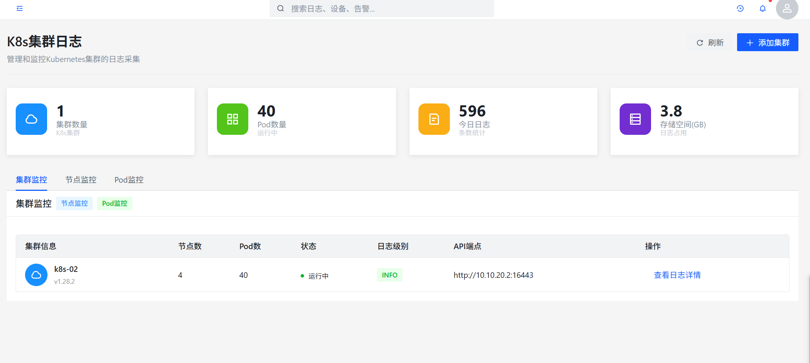
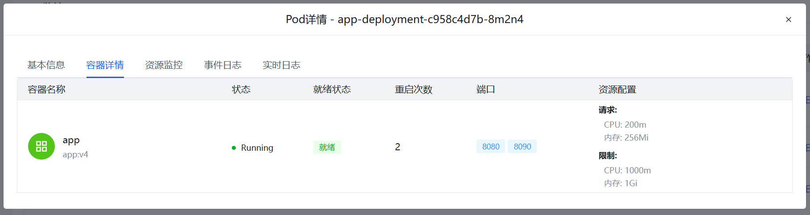
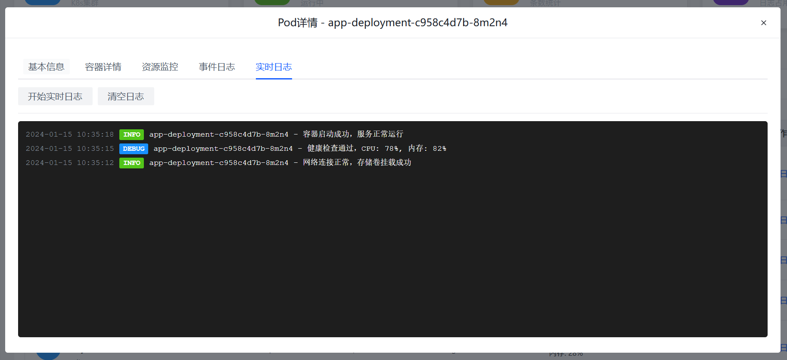
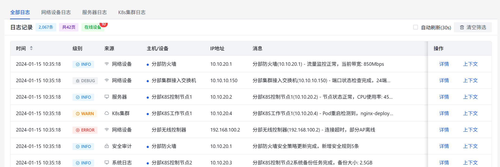
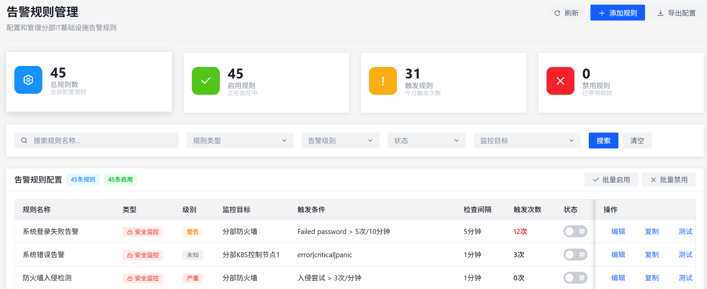
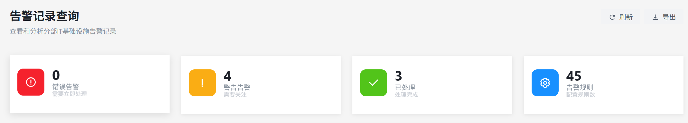

# 安全日志审计平台（综合日志审计分析平台）

## 环境背景介绍

本次安全日志审计平台为纯前端实现，但是为了满足演示要求，需要提供前端状态管理功能，模拟后端功能实现。

背景为网络设备已提前加入本平台进行监控，后续操作服务器、集群等添加至平台进行监控，并设置触发告警机制，并在触发完成后可以通过触发完成告警处理归档。

并且不能让人看出是假的，模拟的。

## 一、安全日志审计平台功能实现

### 资产管理模块

1.平台中网络设备信息前提添加，现场进行服务器资产信息添加（包含元素为：设备信息、设备类型、IP地址、位置、安全防护等级）

### 日志采集模块

2.在服务器日志中添加增加自动发现服务器功能，通过资产管理添加的服务器自动发现并进行日志采集。

3.点击服务器日志详情可以查看服务器日志信息详情。

4.增加集群日志采集接入功能，通过输入集群 Kube-apiserver 实现集群监控日志采集。

5.重点讲解pod详情，详情中实时日志同页面（基本信息、容器详情、实时日志）其他模块删除

     
### 日志管理模块

6.日志管理中日志记录增加类型分类字段

7.排错告警规则配置（服务器+网络设备各添加一条），只有两条规则，其他全部删除。规则为：集群接入交换机和分部K8S集群相关的告警规则（模拟集群接入交换机和集群掉线）。

8.告警记录查询卡片分类点击（点击上面的板块可以进行跳转）-----已处理的告警--，配合告警规则触发会新增两条告警记录为集群接入交换机和集群相关，当错误处理后，自动归类到已处理，并且点击已处理卡片跳转至分类进行告警处理归档信息填写。

在顶部按钮添加点击功能，模拟实现故障触发和故障修复，并且前端需实现接入后端那样的状态管理。

### AI智能分析模块

10.导航栏上网流量审计模块移动到AI智能分析前

11.AI智能分析（暂定）

## 二、故障排错环节
安全平台进行AI日志分析报告输出时---报警灯亮起（由负责人触发）——系统分析师进入警告管理（警告日志查询）查看报警信息——在云平台实时对话框中发送故障截图至聊天框——项目负责人在对话框中进行人员调度协作排障）——排障完成——警报消失（由负责人触发）——分析师上平台查看恢复信息——并报告故障已消失——项目负责进行分工说明——请分析师在平台中填写故障处理记录（两个故障点的记录登记）——网络工程师及系统架构师完成设备标签打印（网络工程师回复:收到，我已在前期准备好设备命名及编辑，现进行标签打印）----项目负责人进行纸质故障单填写及纸质（电子）资料汇总装袋。
