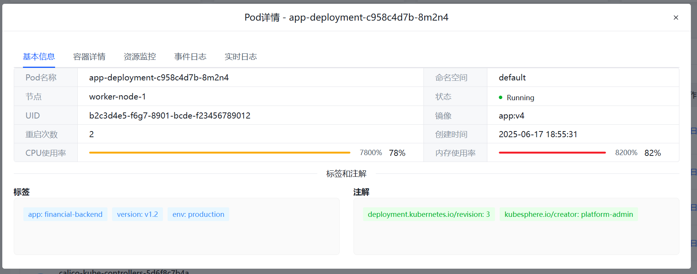
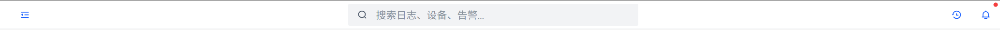

# 安全日志审计平台（综合日志审计分析平台）- 功能实现与演练方案

## 1. 项目背景与核心要求

本次项目旨在构建一个**前后端分离**的安全日志审计平台。前端采用 Vue.js 技术栈，后端将使用 **Python (FastAPI)** 构建，通过 RESTful API 与前端进行数据交互。

核心要求是构建一个功能完整的、可交互的演示原型。平台将预设部分网络设备作为基础数据，演示的核心流程是现场添加服务器与 K8S 集群资产，配置并触发告警，最终完成告警的响应与处理归档。

## 2. 平台功能实现细则

**注意**: 根据最新计划，为快速实现核心演示流程，仅以下模块将完全接入后端实现：

- **2.1. 资产管理模块**
- **2.3. 日志与告警管理模块** (包含全局控制)

其他模块（如日志采集、AI 分析）将暂时保持前端模拟状态，以减少开发工作量。

### 2.1. 资产管理模块 (已完全实现)

此模块负责管理平台监控的所有 IT 资产。所有资产数据将通过后端 API 进行持久化存储，支持完整的增删改查功能。

**1. 资产列表与管理功能**

- **网络设备 (预设数据)**: 平台初始化时，前端通过调用 `GET /api/assets?type=network_device` 获取预设的网络设备信息，状态均为"正常"。

| 设备名称               | 设备类型   | IP 地址        | 位置          | 安全防护等级 |
| :--------------------- | :--------- | :------------- | :------------ | :----------- |
| `Core-Switch-01`       | 核心交换机 | `192.168.1.1`  | 数据中心 A 栋 | 等级三       |
| `Firewall-Main`        | 防火墙     | `10.0.0.1`     | 互联网入口    | 等级三       |
| `Access-Switch-Branch` | 接入交换机 | `192.168.10.1` | 分部机房      | 等级二       |

**2. 完整的资产管理功能**

- **添加资产**:

  - 提供"添加资产"按钮，点击后弹出包含完整安全信息的表单（800px 宽度双列布局）
  - **基础信息字段**：
    - **设备名称**: (输入框，例如 `K8S-Master-Node1`)
    - **设备类型**: (下拉选择：`Linux服务器`, `Windows服务器`, `网络设备`, `K8S集群`)
    - **IP 地址**: (输入框，带格式校验)
    - **位置**: (输入框，例如 `数据中心B栋`)
    - **安全防护等级**: (下拉选择：`等级一`, `等级二`, `等级三`)
  - **扩展安全信息字段**：
    - **制造商**: (输入框，例如 `华为`, `思科`)
    - **设备型号**: (输入框，例如 `CE6851-48S6Q-HI`)
    - **采购日期**: (日期选择器)
    - **保修期限**: (输入框，例如 `3年`)
    - **管理员联系方式**: (输入框，支持邮箱/手机)
    - **备份频率**: (下拉选择：`每天`, `每周`, `每月`, `手动`)
    - **合规状态**: (下拉选择：`合规`, `不合规`, `待检查`)
    - **安全策略**: (多行文本框，描述设备安全配置)

- **编辑资产**:

  - 点击"编辑"按钮弹出编辑表单，预填充现有数据
  - 支持更新所有字段，包括基础信息和安全信息
  - 提交时调用 `PUT /api/assets/{id}` API

- **删除资产**:

  - 点击"删除"按钮弹出确认对话框
  - 确认后调用 `DELETE /api/assets/{id}` API
  - 删除成功后自动刷新资产列表

- **查看资产**:
  - 点击"查看"按钮可查看资产详细信息
  - 显示完整的基础信息和安全信息

**3. 统计功能增强**

- 顶部统计卡片根据实际数据动态计算：
  - **总资产数**: 所有资产的总数量
  - **在线设备**: 状态为"normal"的设备数量
  - **异常设备**: 状态为"warning"的设备数量
  - **离线设备**: 状态为"error"的设备数量


### 2.2. 日志采集模块 (前端模拟)

此模块模拟对不同资产的日志采集过程。

**1. 服务器日志采集**

- **自动发现**: 在"日志采集 > 服务器"页面，提供一个"**开始扫描**"按钮。
- **模拟扫描**: 点击按钮后，显示一个加载动画或进度条，模拟正在网络中发现新设备。1-2 秒后，动画结束，"发现"在【资产管理】中新添加的服务器，并将其显示在列表中。
- **采集状态**: 服务器列表应有一列"采集状态"，初始为"采集中..."，几秒后变为"已连接 - 实时采集中"，并显示一个绿色的动态图标，增强真实感。
- **查看详情**: 点击任一服务器可进入详情页，展示该服务器的模拟日志流。


**2. 集群日志采集**

- **集群接入**: 在"日志采集 > Kubernetes"页面，提供"**接入新集群**"功能。
- **接入表单**: 点击后弹出表单，要求输入"**集群名称**"和"**Kube-apiserver 地址**"。
- **模拟接入**: 点击"确定"后，模拟网络连接和认证过程（可显示"正在验证连接..."提示）。数秒后，提示"集群 `[集群名称]` 接入成功"，并将其添加至集群列表。
- **Pod 详情页 (核心)**:
  - 点击集群可查看 Pod 列表。点击任一 Pod，进入详情页。
  - **页面布局**: 严格按照 `基本信息`、`容器详情`、`实时日志` 单页面区域布局，移除其他无关模块。
  - **基本信息**: 展示 Pod 的静态信息，如 `名称`, `命名空间`, `节点IP`, `状态` 等。
  - **容器详情**: 展示容器列表及其状态。
  - **实时日志 (重点)**: 此区域应模拟一个终端窗口，每隔 1-2 秒自动滚动刷新，动态追加新的、格式逼真的模拟日志条目，例如：
    ```
    2023-10-27T10:00:05.123Z [info] Request received: GET /api/v1/health
    2023-10-27T10:00:05.125Z [info] Health check successful
    2023-10-27T10:00:07.456Z [warn] High CPU usage detected on container 'webapp'
    ```




### 2.3. 日志与告警管理模块

**1. 日志记录分类**

- 在"日志管理"主页面，前端通过 `GET /api/logs` 获取所有汇聚的日志。API 支持按"**日志类型**"字段进行筛选。
- 建议类型包括：`安全审计`, `系统操作`, `应用异常`, `网络流量`, `K8S事件`。


**2. 告警规则配置 (核心模拟)**

- 在"告警管理 > 规则管理"页面，前端通过 `GET /api/alert-rules` 获取预设规则并展示。后端仅提供以下两条规则。
  1.  **规则一**:
      - **名称**: `核心网络设备离线告警`
      - **监控对象**: 网络设备 - `Access-Switch-Branch`
      - **触发条件**: `连续5分钟未收到心跳` (文字描述即可)
      - **告警等级**: `严重`
  2.  **规则二**:
      - **名称**: `K8S集群API Server无响应`
      - **监控对象**: K8S 集群 - `分部K8S集群` (演示时接入的集群)
      - **触发条件**: `Kube-apiserver 连接超时` (文字描述)
      - **告警等级**: `严重`


**3. 告警记录与处理流程**

- **页面布局**: 在"告警管理 > 告警记录"页面，默认展示**待处理**的告警列表。页面顶部的卡片式分类导航 (`待处理`, `已处理`, `已归档`) 用于快速切换不同状态的告警列表，其数量通过 `GET /api/alerts/stats` 接口获取。
- **故障触发与告警生成**:
  - 见下方【全局控制】。当"**触发故障**"被点击时，前端调用 `POST /api/simulation/trigger-fault`。后端将自动生成上述两条规则对应的告警，存入数据库。前端刷新后，顶部"待处理"卡片的数字会增加 `2`。
- **故障恢复与告警处理**:
  - 当"**修复故障**"被点击时，前端调用 `POST /api/simulation/fix-fault`。后端将对应告警的状态更新为"已处理"。
  - 前端在"已处理"列表中可以看到刚刚修复的告警。
- **告警归档**:
  - 在"已处理"列表中，点击告警的"归档"按钮，会弹出"**告警处理归档**"表单。
  - **归档表单**: 包含字段 `处理人`, `处理时间` (前端可预填充), `根本原因分析`, `解决方案`, `遗留问题`。填写后，前端通过 `POST /api/alerts/{alert_id}/archive` 提交，后端完成归档，告警将移至"已归档"列表。


**4. 全局模拟控制**

- 在系统界面的顶部导航栏或一个不显眼的角落，设置两个全局控制按钮：
  1.  `[触发故障]`
  2.  `[修复故障]`
- 这两个按钮是整个演示的核心，它们通过调用后端 API 来控制整个系统的状态。
  - **点击 [触发故障]**: 调用 `POST /api/simulation/trigger-fault`
    1.  后端将 `Access-Switch-Branch` 和 `分部K8S集群` 的资产状态更新为"异常/红色"。
    2.  后端在告警记录中新增两条待处理告警。
    3.  (可选) 后端在相关资产的详情页中，注入能反映故障的模拟日志。
  - **点击 [修复故障]**: 调用 `POST /api/simulation/fix-fault`
    1.  后端将上述资产的状态恢复为"正常/绿色"。
    2.  后端将对应的告警状态从未处理/处理中更新为已解决。



### 2.4. AI 智能分析模块 (前端模拟)

1.  **导航顺序**: 将"上网流量审计"导航项移动到"AI 智能分析"之前。
2.  **AI 分析报告 (模拟)**:
    - 此页面用于展示 AI 分析的能力。
    - 提供一个"**生成本周安全态势分析报告**"按钮。
    - 点击后，显示加载动画和提示："AI 大模型正在分析海量日志，请稍候..."。
    - 3-5 秒后，显示一份预设好的、图文并茂的静态分析报告。报告应包含：
      - **安全评分**: 例如 `92分`。
      - **威胁趋势图**: 一张看似动态的图表（可使用 Chart.js 等库绘制静态数据）。
      - **主要发现**: 文字描述，如"检测到来自 XX 的恶意扫描 IP..."、"`K8S-Master-Node1` 存在 XX 漏洞风险..."。
      - **优化建议**: 列出几条具体的安全建议。

## 3. 后端架构设计

为支撑上述功能，后端采用以下技术栈和设计：

- **语言与框架**: `Python 3.9+` + `FastAPI`
- **数据库**: `SQLite` (通过 `SQLAlchemy` ORM 进行交互，便于开发和演示)
- **API 设计**:
  - 遵循 RESTful 风格。
  - 使用 Pydantic 进行数据校验和序列化。
  - 通过依赖注入管理数据库会话等共享资源。

### 3.1. API 端点 (Endpoints)

| 模块           | HTTP 方法 | 路径                             | 描述                           |
| :------------- | :-------- | :------------------------------- | :----------------------------- |
| **资产管理**   | `GET`     | `/api/assets`                    | 获取所有资产列表，可按类型筛选 |
|                | `POST`    | `/api/assets`                    | 添加新资产（包含完整安全信息） |
|                | `GET`     | `/api/assets/{asset_id}`         | 获取单个资产的详细信息         |
|                | `PUT`     | `/api/assets/{asset_id}`         | 更新资产信息（包含安全字段）   |
|                | `DELETE`  | `/api/assets/{asset_id}`         | 删除指定资产                   |
| **日志与告警** | `GET`     | `/api/logs`                      | 查询日志记录，支持按类型筛选   |
|                | `GET`     | `/api/alert-rules`               | 获取预设的告警规则             |
|                | `GET`     | `/api/alerts`                    | 获取告警记录，支持按状态筛选   |
|                | `GET`     | `/api/alerts/stats`              | 获取各状态告警的数量统计       |
|                | `POST`    | `/api/alerts/{alert_id}/process` | 开始处理一条告警               |
|                | `POST`    | `/api/alerts/{alert_id}/archive` | 归档一条已处理的告警           |
| **全局控制**   | `POST`    | `/api/simulation/trigger-fault`  | 触发全局故障                   |
|                | `POST`    | `/api/simulation/fix-fault`      | 修复全局故障                   |

### 3.2. 数据模型 (Pydantic & SQLAlchemy)

- **`Asset`**: 定义资产模型，包含完整的基础信息和安全信息字段：
  - **基础字段**: `id`, `name`, `asset_type`, `ip_address`, `location`, `security_level`, `status`, `created_at`, `updated_at`
  - **安全信息字段**: `manufacturer`, `model`, `purchase_date`, `warranty_period`, `admin_contact`, `security_policies`, `backup_frequency`, `last_security_scan`, `compliance_status`
- **`AlertRule`**: 定义告警规则模型。
- **`Alert`**: 定义告警记录模型，包含关联规则、状态、处理详情等。
- **`Log`**: 定义日志记录模型。

## 4. 故障排错应急演练流程 (演示剧本)

此环节旨在通过角色扮演，串联平台功能，展示应急响应的全过程。

| 步骤 | 角色                  | 操作/对话                                                                                                                                       | 平台功能联动                                                                                                                                 |
| :--- | :-------------------- | :---------------------------------------------------------------------------------------------------------------------------------------------- | :------------------------------------------------------------------------------------------------------------------------------------------- |
| 1    | **负责人**            | "演练开始。模拟生产环境 `Access-Switch-Branch` 交换机和 `分部K8S集群` 同时发生故障。" (说罢，**点击全局 `[触发故障]` 按钮**)                    | 1. 前端调用 `POST /api/simulation/trigger-fault`。<br>2. 后端更新资产状态并生成告警。<br>3. 前端刷新后，资产状态变红，告警页面出现新告警。   |
| 2    | **系统分析师**        | "收到！平台已检测到告警。" (迅速切换到 **告警记录查询** 页面) "我看到一条核心网络设备离线告警和一条 K8S 集群 API Server 无响应告警。正在分析。" | 前端调用 `GET /api/alerts?status=pending`，展示"待处理"列表中的两条严重告警。                                                                |
| 3    | **系统分析师**        | (在企业微信/钉钉等外部聊天工具中) "@项目负责人 @网络工程师 @系统架构师，平台捕获到严重告警，截图如下，请立即响应！" (发送告警页面的截图)        | 演示如何从平台获取关键信息并用于外部协作。                                                                                                   |
| 4    | **项目负责人**        | (在聊天工具中) "收到。网络工程师负责排查交换机问题，系统架构师负责 K8S 集群。立即行动！"                                                        | -                                                                                                                                            |
| 5    | **工程师 (模拟排障)** | (过一段时间后) 网络工程师："交换机已重启，恢复正常。" 系统架构师："K8S API Server 已恢复。"                                                     | -                                                                                                                                            |
| 6    | **负责人**            | "好，故障已排除。" (说罢，**点击全局 `[修复故障]` 按钮**)                                                                                       | 1. 前端调用 `POST /api/simulation/fix-fault`。<br>2. 后端更新资产状态和告警状态。<br>3. 前端刷新后，资产状态恢复为绿色，告警从未处理中消失。 |
| 7    | **系统分析师**        | "我正在确认。平台显示资产状态已恢复正常，告警已自动清除。" (刷新页面或等待数据更新) "现在，我需要对这两个故障进行处理归档。"                    | 导航到"已处理"告警列表 (`GET /api/alerts?status=resolved`)，找到刚刚恢复的告警。                                                             |
| 8    | **系统分析师**        | (点击告警的"归档"按钮) "正在填写故障处理记录...根本原因是...解决方案是..." (现场填写并提交表单)                                                 | 前端调用 `POST /api/alerts/{alert_id}/archive`，完成告警处理的闭环流程。                                                                     |
| 9    | **项目负责人**        | "很好。分析师归档的同时，网络工程师和系统架构师请完成设备标签的更新和打印。"                                                                    | -                                                                                                                                            |
| 10   | **网络工程师**        | (在聊天工具中) "收到，我已在前期准备好设备命名及编辑，现进行标签打印。"                                                                         | -                                                                                                                                            |
| 11   | **项目负责人**        | "所有流程已完成。我将汇总所有电子和纸质记录，本次应急演练结束。"                                                                                | -                                                                                                                                            |
